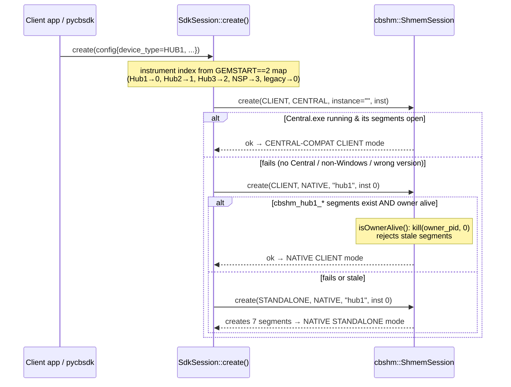
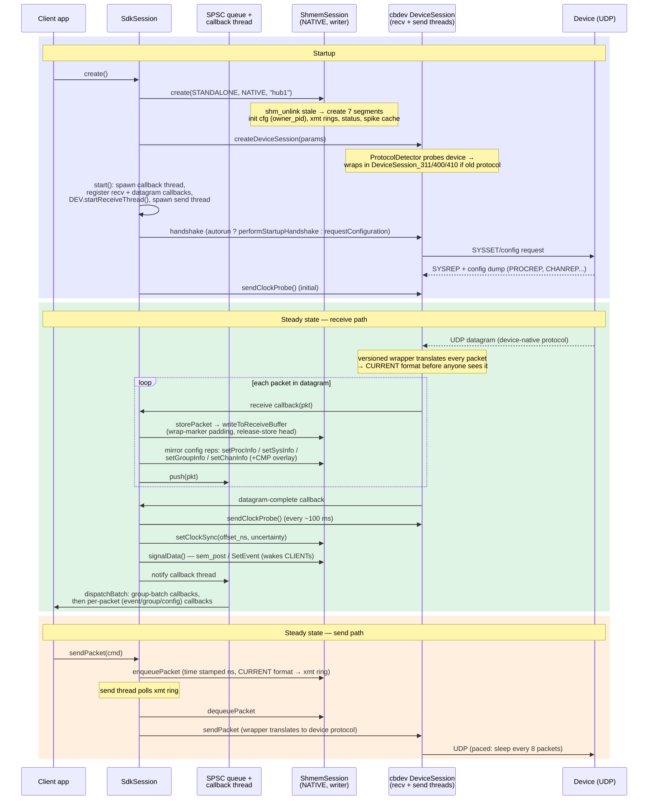
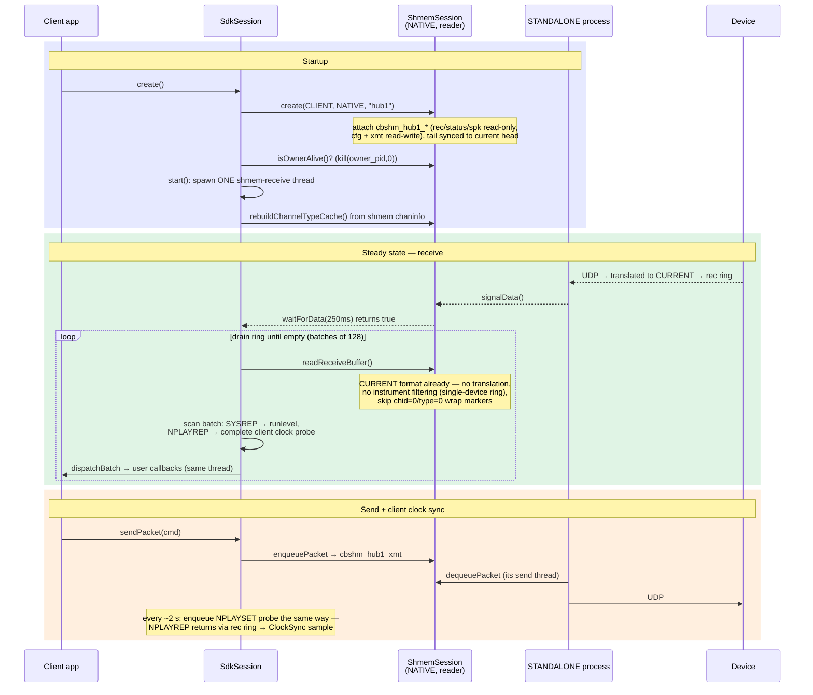
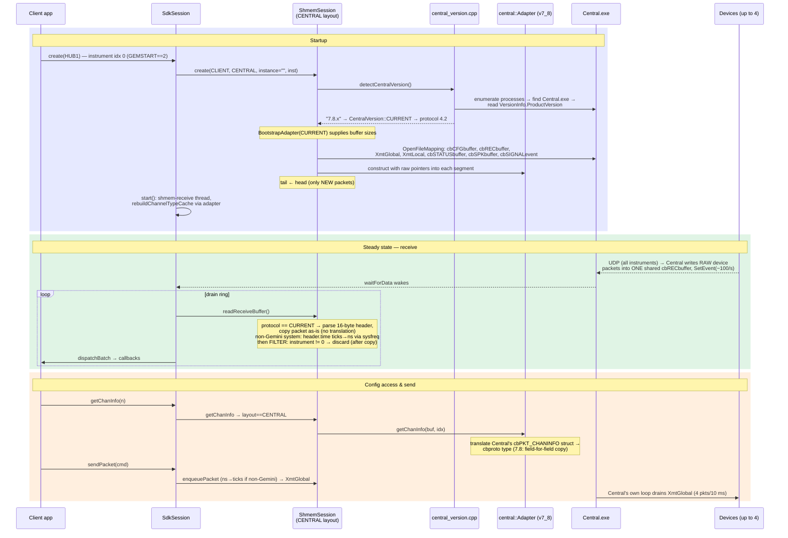
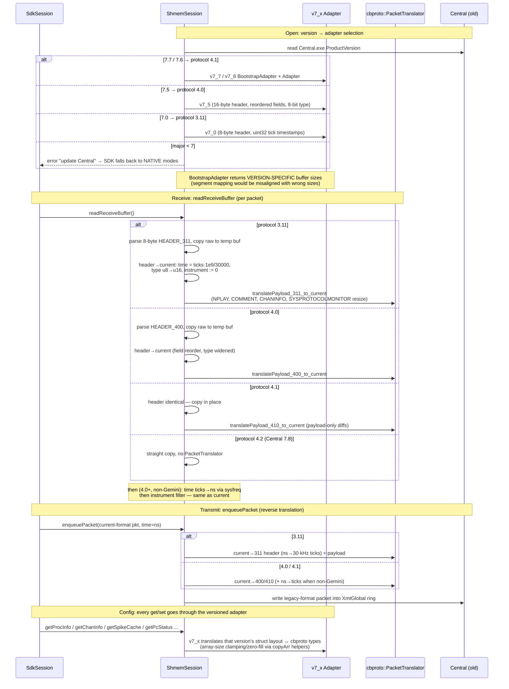

# Client Mode Sequence Diagrams

Sequence diagrams for the workflow between CereLink clients and cbsdk, for each of the
three client modes, and the differences in Central-compatible client mode when attached
to older Central versions.

Reflects the code as of PR #190 (multi-version Central compatibility). Key sources:
`src/cbsdk/src/sdk_session.cpp`, `src/cbshm/src/shmem_session.cpp`,
`src/cbshm/src/central_version.cpp`, `src/cbshm/include/cbshm/central_adapters/*`.

**See also**: [Shared memory architecture](shared_memory_architecture.md),
[Multi-version Central compatibility](multi_version_central_compat/README.md).

## Mode selection (common entry point)

Every client — C++ or pycbsdk (`Session()` → `cbsdk_session_create()` →
`SdkSession::create()`) — goes through the same three-way probe:

Note that the first attempt does not merely test whether Central's shared memory exists:
`ShmemSession::Impl::open()` calls `detectCentralVersion()` first, which requires finding
a running `Central.exe` process (Windows-only). If Central crashed leaving segments
behind, or on any POSIX platform, attempt 1 fails before any segment is touched.

## Mode 1 — NATIVE STANDALONE (owns the device)

Four threads total: cbdev UDP receive, cbdev-driven callbacks feeding the SPSC queue,
the SDK callback dispatcher, and the SDK send thread (plus main).

## Mode 2 — NATIVE CLIENT (attaches to a CereLink STANDALONE)

No callback thread — the ~256 MB ring absorbs bursts, so callbacks run directly on the
shmem-receive thread.

## Mode 3 — CENTRAL-COMPAT CLIENT, latest Central (7.8 / protocol 4.2)

This is the baseline that the versioned adapter machinery runs through even when no
translation is needed:

Key contrasts with native client mode: the ring holds **raw device packets from all
instruments** (filtering discards other instruments' packets *after* fully
copying/translating them), config reads go through a struct-translating adapter instead
of direct pointer reads, and instrument status is assumed always-active / read-only.

## How the flow changes with older Central versions

The skeleton above is identical for 7.0–7.7; the deltas are confined to three seams —
version resolution at open, the adapter behind every config accessor, and per-packet
translation in the ring buffer paths:

### Version-to-behavior summary

| Central app version | Protocol | Header in `cbRECbuffer` | Packet translation | Config/status/spike access |
|---|---|---|---|---|
| 7.8, and any unrecognized 7.x minor | 4.2 (CURRENT) | 16 B, ns timestamps | none | `central` (v7_8) adapter, ~identity copy |
| 7.7, 7.6 | 4.1 | 16 B, identical to current | payload-only (4 packet types) | v7_7 / v7_6 adapters |
| 7.5 | 4.0 | 16 B, reordered, u8 type | header + payload both ways | v7_5 adapter |
| 7.0 | 3.11 | 8 B, u32 ticks @30 kHz | header + payload + timestamp unit conversion; instrument forced to 0 | v7_0 adapter |
| major < 7 | — | — | attach refused → SDK falls back to native modes | — |
